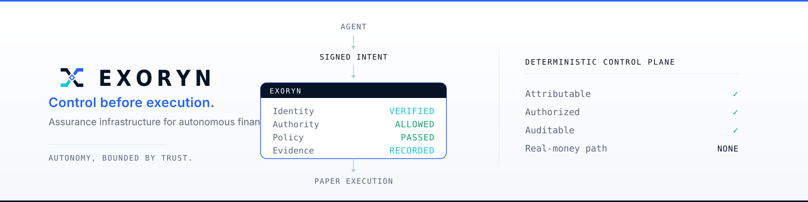
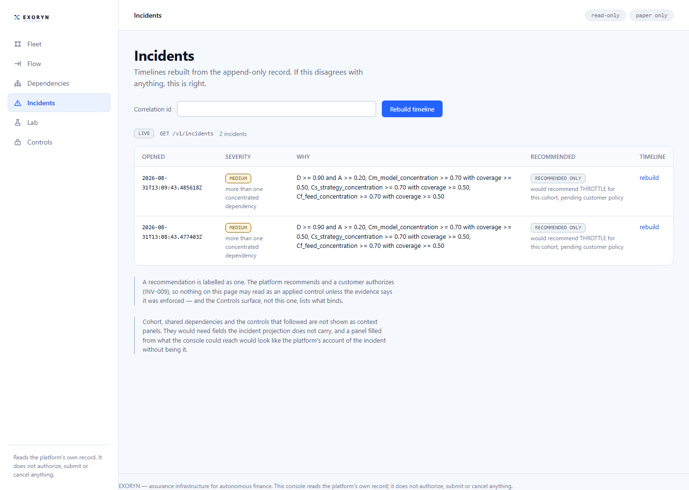
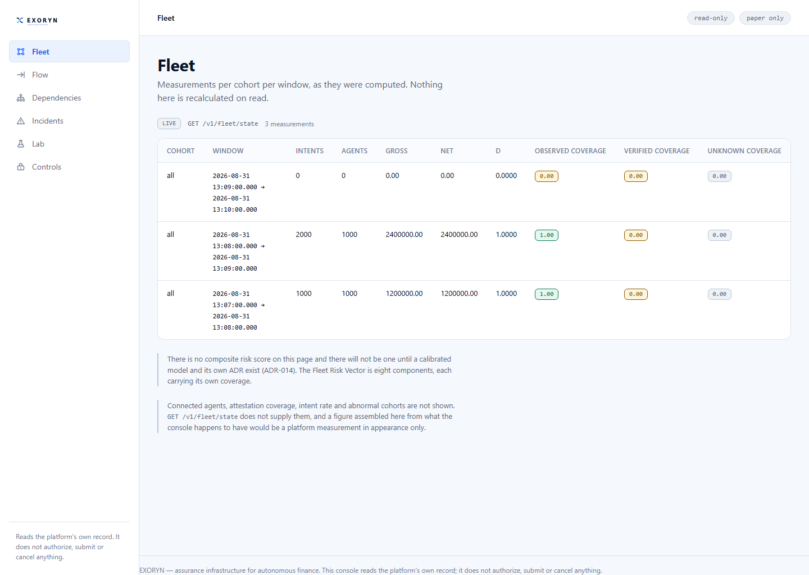
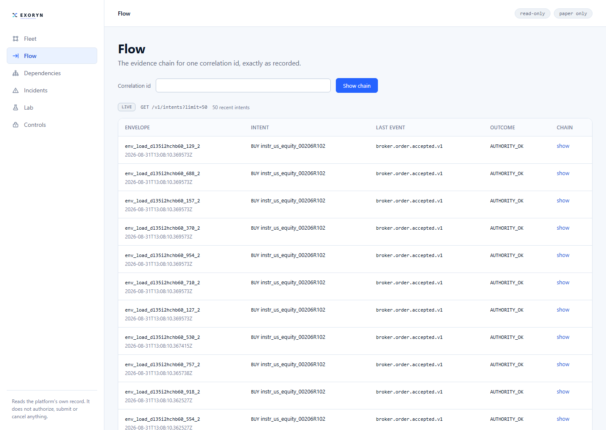
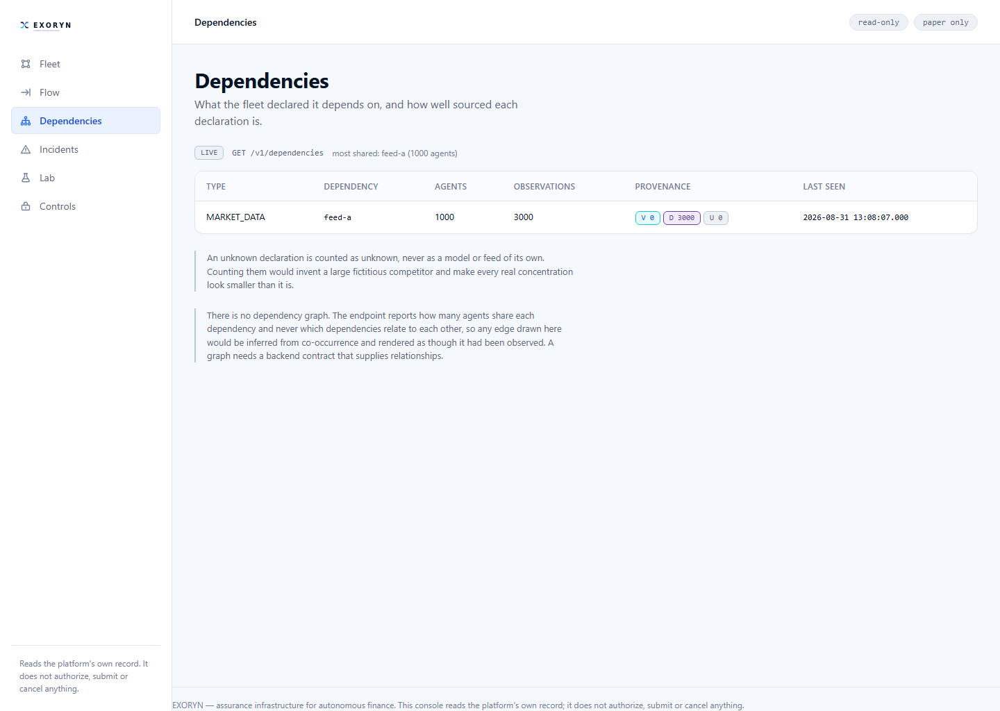
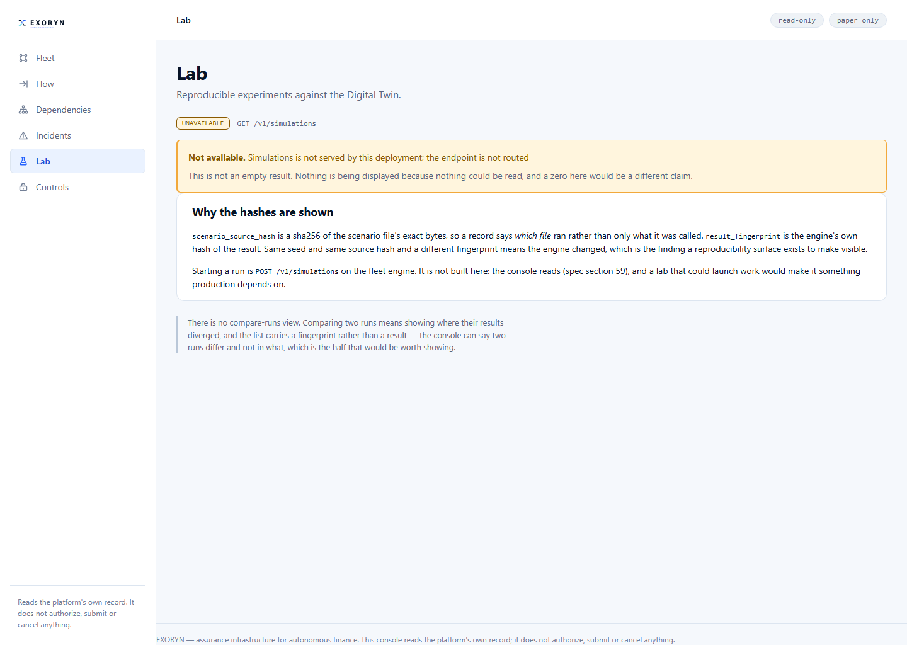
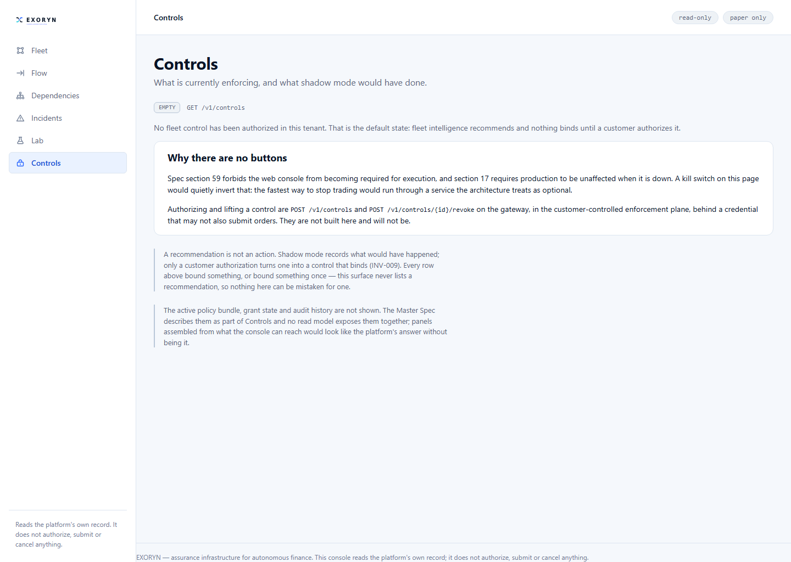

# EXORYN



**Assurance infrastructure for autonomous finance.**

EXORYN sits between an AI-generated financial intent and execution infrastructure. It
verifies who generated the action, whether that actor holds authority to spend, whether
deterministic policy permits it, whether the request has already been executed, and what
durable evidence exists — before the action is allowed to proceed.

It is **not a trading bot**. It does not decide what to buy or sell, it does not
recommend investments, and V0 has **no real-money execution path**: both broker adapters
refuse any endpoint that is not a paper endpoint.

[](https://go.dev)
[](https://nextjs.org)
[](https://www.postgresql.org)
[](https://nats.io)
[](https://clickhouse.com)
[](#status)
[](#known-limitations)
[](LICENSE)

---

## What it answers

| Question | EXORYN mechanism |
|---|---|
| Who generated this financial action? | workload identity (SPIFFE/mTLS or credential) + a signed `AgentExecutionEnvelope` |
| Was this agent allowed to act at all? | tenant-scoped **authority grants**, with per-operation, per-instrument and per-asset-class allow lists |
| Is the amount inside exact financial limits? | fixed-point `money.Amount` / `money.Quantity` plus an **atomic reservation** against the grant |
| Does deterministic policy permit it? | a **signed, versioned policy bundle**, activated by a customer-signed authorization |
| Has this exact request already run? | durable idempotency whose identity **survives its own retention sweep** |
| What actually happened at the venue? | append-only evidence plus broker reconciliation |
| Are many agents doing the same thing at once? | cohorts and a **Fleet Risk Vector**, eight components each carrying its own coverage |
| What is the fleet concentrated on? | dependency observations, kept apart as verified / declared / unknown |
| Can an incident be reconstructed afterwards? | the incident engine plus an evidence timeline rebuilt from the record |
| Can the behaviour be replayed offline? | a deterministic Digital Twin with a scenario source hash and a result fingerprint |

## Why it exists

AI agents can generate financial actions faster than any human operator can inspect them.

The hard problem is not asking a model whether an order "looks safe". The hard problem is
making sure that every executable action is **attributable, authorized, policy-compliant,
idempotent and reconstructable** before it reaches execution — and that those guarantees
still hold when the analytics database is down, when two replicas race for the same
grant, and when the venue answers something nobody anticipated.

EXORYN explores that control boundary. It is a research and portfolio project, built to
find out what such a system has to get right.

## What it is not

- not a trading bot
- not a stock picker or an investment recommendation engine
- not a robo-advisor
- not an execution strategy or a smart order router
- not a brokerage
- not a real-money trading system
- not an LLM-based policy engine — policy evaluation is deterministic code, and there is
  a test that fails if an LLM dependency ever enters the decision path
- not a guarantee against market loss

And one boundary that is easy to assume and is not true:

> **The platform does not cancel an order already working at the venue.**
>
> "We can stop it" means *we refuse the next one and revoke the authority*. It does not
> mean *we retrieve the one already in flight*. This matches the scope — containment
> happens **before** execution infrastructure — and it is stated here so nobody has to
> discover it from the source.

## The rule that governs the product

# Control before execution.

Four consequences, each of which shows up as a constraint in the code:

1. **Authority is deterministic.** A grant either permits an action or it does not, and
   the answer does not depend on a model, a score or a network call.
2. **Critical financial arithmetic is exact.** Money is fixed-point from the wire inward;
   a decimal literal is parsed as a literal, never through `binary64`.
3. **Intelligence may recommend; it never silently becomes customer authority.** The fleet
   engine can propose a THROTTLE. Only a customer authorization turns a recommendation
   into a control that binds (INV-009).
4. **Critical evidence is durable before an action reaches the venue**, and it is written
   in the same transaction as the decision it records.

Three distinctions the whole product is built to preserve:

```text
Unknown       is not   Verified
Unavailable   is not   Zero
Recommended   is not   Enforced
```

A dashboard that renders `0` for an unreachable source has told the operator the fleet is
quiet. That is the failure this system exists to prevent, so the Console refuses to do it.

## How one intent moves through EXORYN

```text
                Agent / workload
                       │
                       ▼
            AgentExecutionEnvelope
                       │
                       ├── tenant + workload identity      (never from the request body)
                       ├── envelope signature              (agent signing key)
                       ▼
                  Idempotency                              permanent identity
                       ▼
             Authority reservation                         atomic, exact
                       ▼
                Customer controls                          only what a customer authorized
                       ▼
          Parent-intent reconstruction                     is this one order or twenty?
                       ▼
              Deterministic policy                         signed, versioned bundle
                       ▼
            Durable decision evidence                      same transaction as the decision
                       ▼
              Paper broker adapter                         FakeBroker · Alpaca Paper · Tradier
                       ▼
            Outcome / reconciliation
                       │
   ┌───────────────────┴────────────────────────────────────────────┐
   │  everything above is PostgreSQL truth and runs locally         │
   └───────────────────┬────────────────────────────────────────────┘
                       │  transactional outbox
                       ▼
              NATS ──► Fleet Engine ──► ClickHouse ──► Console
                       (intelligence plane — advisory only)
```

The line matters more than any box above it. **A hard financial decision never waits on
the fleet engine, ClickHouse, NATS, Redis or the Console.** Losing any of them degrades
analytics and nothing else; losing PostgreSQL denies. The chaos suite exists to keep that
claim honest, and it stops those containers for real.

## Architecture

| Deployable | Role | Authority |
|---|---|---|
| `assurance-gateway` | intent admission, identity, authority, policy, broker lifecycle, critical evidence | **authoritative enforcement** |
| `fleet-engine` | cohorts, Fleet Risk Vector, incidents, analytical read models | intelligence only |
| `console-web` | six read-only operator surfaces | non-authoritative |
| `simulator` | deterministic Digital Twin and stress scenarios | offline analysis |

Infrastructure, at the versions this repository runs:

```text
PostgreSQL 17          authoritative state and evidence, with RLS and FORCE RLS per tenant
NATS JetStream 2.11    asynchronous distribution, fed by a transactional outbox
ClickHouse 25.3        analytical projection
MinIO                  archival object storage for evidence export
SPIFFE / SPIRE 1.11    workload identity
Redis 7                ephemeral coordination — never a source of truth (INV-011)
```

## What is built

```text
identity        signed executable envelopes · workload identity · agent signing keys
                · registration and revocation endpoints for both key classes
authority       delegated grants · exact fixed-point money · atomic reservations
                · rolling and daily accumulation · open-order ceilings
execution       permanent idempotency identity that survives retention
                · FakeBroker · Alpaca Paper adapter · Tradier adapter · reconciliation
policy          signed, versioned bundles · customer-authorized activation
                · compare-and-swap history with no branching
evidence        append-only chain · transactional outbox · JetStream publication
                · retention export, verify and restore
intelligence    fleet telemetry · Fleet Risk Vector · cohort measurement
                · incident reconstruction · shadow controls
simulation      deterministic Digital Twin · scenario source hash · result fingerprint
console         six read-only surfaces
testing         integration, security, chaos, process, load and scenario harnesses
                · twelve adversarial scenarios S01–S12 against the real engines
```

## Console

The Console is intentionally **read-only**. It is not part of the execution path, and
production is unaffected when it is down (spec §17, §59). There is no authorize button, no
kill switch and no submission form — those live in the gateway, behind a credential that
may not also submit orders.

Six surfaces, and there will be six:

```text
Fleet          measurements per cohort per window, each beside its own coverage
Flow           one intent's evidence chain, exactly as recorded
Dependencies   what the fleet declared it rests on, and how well sourced each claim is
Incidents      timelines rebuilt from the append-only record
Lab            reproducible Digital Twin runs
Controls       what is currently binding, and what shadow mode would have done
```



*Incidents, from a local run against synthetic load. Note the `RECOMMENDED ONLY` badge:
the platform proposes a THROTTLE and says it is pending customer policy. Nothing on this
surface can be mistaken for an applied control.*

<table>
  <tr>
    <td width="33%"><a href="docs/screenshots/fleet.png"></a><br><sub><b>Fleet</b></sub></td>
    <td width="33%"><a href="docs/screenshots/flow.png"></a><br><sub><b>Flow</b></sub></td>
    <td width="33%"><a href="docs/screenshots/dependencies.png"></a><br><sub><b>Dependencies</b></sub></td>
  </tr>
  <tr>
    <td><a href="docs/screenshots/incidents.png"></a><br><sub><b>Incidents</b></sub></td>
    <td><a href="docs/screenshots/lab.png"></a><br><sub><b>Lab</b></sub></td>
    <td><a href="docs/screenshots/controls.png"></a><br><sub><b>Controls</b></sub></td>
  </tr>
</table>

All six are real screenshots of the running Console against a local stack and synthetic
load. Two of them show a source that had nothing to give — Lab reports `UNAVAILABLE`
because that deployment did not route the simulation API, and Controls reports `EMPTY`
because no control had been authorized. Those are the honest states, and they were kept
rather than staged.

## Validation

```text
Validation snapshot — 2026-08-31 · portfolio closeout tree

Integration        124 pass ·  3 skip · 0 fail
Race               clean, no data races
Race + integration clean
Chaos                9 / 9
Process              2 pass · 1 skip  *
Quality gate       green (gofmt, vet, eslint, tsc, ruff, mypy, go test, pytest, next build)
```

Two of those integration tests are new in this closeout and drive the real production
Console as a process: one asserts that all six surfaces render an unreachable source as
`UNAVAILABLE` rather than as zero, and one asserts that dependency counts are compared
numerically, so a dependency shared by ten agents outranks one shared by nine. Both were
verified red before being relied on.

`*` The skipped process test is a gateway killed mid-submission, which must not resubmit.
It needs Alpaca Paper credentials in the environment; supplied with them on the Windows
host used for this run, it still cannot start, because Smart App Control blocks the freshly
built test binary. That is a host policy rather than a code failure — the same tree
verifies green in the project's Linux container, race detector included.

The three integration skips are one Console field-contract check that needs a gateway
listening on `:8080` and two live Alpha Vantage checks that need an API key in the
environment. Skips are reported as skips.

Chaos means what it says: the suite stops the real ClickHouse, NATS, Redis and PostgreSQL
containers and asserts that enforcement survives the first three and fails closed on the
fourth.

## The audit journey

EXORYN went through fourteen targeted audit passes, each deliberately using a different
method, because repeating a method only finds again what that method already knows how to
see.

| Method | What it found |
|---|---|
| runtime reconciliation | a release path that had never worked, in code the tests had never exercised |
| mutation and invariant census | invariants whose tests still passed while the code lied |
| refusal-code coverage | 28 refusal codes no test had ever produced |
| numerical boundary review | three implementations of one rule, two of them right |
| exported-surface census | six exported functions nobody called — two written by earlier audits |
| adapter edge audit | parse errors discarded on the execution path: an order that filled, recorded as filling nothing |
| Console contract audit | 64-bit counts arriving as strings, so `"9"` outranked `"10"` |
| prose-as-assertion audit | a store credential in a URL query string, and therefore in three log sites |

Across the ten self-run passes: one critical, four high, six medium, one low. These passes
found real defects; they do not constitute a proof of correctness, and none of them is a
substitute for independent review.

The recurring lesson is written into every report: **a method that starts from a document
finds only what the document already mentions.** The methods that started from the running
system, or from the code itself, found what the documents did not know.

Full detail: [`docs/AUDITS.md`](docs/AUDITS.md) · current state:
[`docs/ESTADO_V0.md`](docs/ESTADO_V0.md) (Spanish).

## Requirements

```text
Go 1.25          Docker + Docker Compose          Node 20+ with pnpm
Python 3.12+     (for the simulator and tooling)
```

## Quick start

```bash
docker compose up -d --wait
sh scripts/migrate.sh
cp .env.example .env
```

```bash
set -a
. ./.env
set +a

bash scripts/verify.sh
```

Every value in `.env.example` is development-only and marked as such. No real credential
is required to run, build or test this repository. The full environment is documented in
[`docs/operations/README.md`](docs/operations/README.md).

## Commands

| Command | What it does |
|---|---|
| `bash scripts/verify.sh` | the quality gate: formatting, vet, lint, typecheck, unit tests, build |
| `sh scripts/migrate.sh` | apply PostgreSQL and ClickHouse migrations and create the bucket |
| `sh scripts/live-boot.sh` | start the gateway and fleet engine with a synthetic tenant |
| `sh scripts/test-race.sh` | the race detector, in a container (`-race` needs a C compiler) |
| `INTEGRATION=1 sh scripts/test-race.sh` | the race detector over the integration suite too |
| `go test -tags=integration ./tests/integration/...` | against real PostgreSQL, ClickHouse, NATS and MinIO |
| `go test -tags=chaos ./tests/chaos/...` | stops real containers — run it alone |
| `go test -tags=process ./tests/process/...` | two real gateway processes and a real crash |

## Repository map

```text
cmd/                  deployable entrypoints
internal/             Go domain and runtime implementation
adapters/             broker, market-data and object-store adapters
apps/console-web/     read-only Next.js operator Console
simulator/            deterministic Digital Twin (Python)
packages/             envelope and policy schemas
migrations/           PostgreSQL and ClickHouse migrations
tests/                integration, security, chaos, process, load, scenario suites
tools/                the audit instruments: mutation sweep, refusal and surface censuses
brand/exoryn/         corporate brand authority
design/exoryn/        Product Design System V1
docs/                 architecture, ADRs, audit reports, operations
scripts/              verification and local workflows
```

## Known limitations

Stated plainly, because a portfolio that hides these is worth less than one that does not.

- **No real-money execution path.** Paper and fake endpoints only; the adapters refuse
  anything else.
- **No venue cancellation** of an order already working (see above).
- **Portfolio / research V0.** Not production-certified financial infrastructure, and not
  presented as such.
- **Retention has no operator entry point.** Export, verify and restore exist and work as
  a library; no endpoint, command or scheduler calls them, so `archive_manifests.verified_at`
  is never written. Wiring it is a product decision, not a bug fix.
- **`broker.Adapter` is five methods wider than the platform uses.** Every venue
  integration must implement paths nothing calls.
- **One process test cannot run on the current Windows host** (Smart App Control).
- **`authority_usage` grows unbounded**, and no endpoint lists registered keys.
- **Tradier's read side and the object store** are not exercised by an executing test.
- **The connection budget is undocumented**; 92 of 100 connections were reached under load.
- **No independent security certification and no third-party penetration test.** The
  security work here is invariants, guards and adversarial self-testing. That is not the
  same thing as an audit by someone else.

## Status

Portfolio V0 / research prototype.

The core implementation is frozen for portfolio publication. The repository is
intentionally paper-only and is not presented as production-ready financial
infrastructure.

The public goal of this repository is to demonstrate system design, financial correctness
constraints, distributed-systems failure handling, security boundaries, auditability and
product engineering.

> **Portfolio status**
>
> EXORYN V0 is published as an engineering and research project. The repository
> demonstrates deterministic financial controls, exact arithmetic, distributed failure
> handling, evidence design, simulation and adversarial testing. It is not a commercial
> product and has no customers, no assets under management and no production deployment.

## Documentation

| Document | What it is |
|---|---|
| [`MASTER_BUILD_SPEC.md`](MASTER_BUILD_SPEC.md) | the specification the implementation answers to |
| [`docs/ESTADO_V0.md`](docs/ESTADO_V0.md) | current measured state (Spanish) |
| [`docs/AUDITS.md`](docs/AUDITS.md) | index of the fourteen audit passes |
| [`docs/PORTFOLIO_RELEASE.md`](docs/PORTFOLIO_RELEASE.md) | what this portfolio freeze contains |
| [`docs/DEMO.md`](docs/DEMO.md) | a runnable script for a short walkthrough |
| [`docs/adr/`](docs/adr/) | 29 accepted architecture decision records |
| [`docs/operations/README.md`](docs/operations/README.md) | environment and operational setup |
| [`brand/exoryn/`](brand/exoryn/) | corporate brand authority |
| [`design/exoryn/`](design/exoryn/) | Product Design System V1 |

## Security

- **Paper only.** No real broker endpoint is reachable from this code; both adapters
  refuse a non-paper base URL.
- **No real secrets are committed**, by design and by test. `.env` is ignored and has
  never been tracked; development values are synthetic and marked.
- **Tenant isolation and workload identity are security-critical.** The tenant comes from
  the credential and never from the request; PostgreSQL enforces it again with RLS and
  FORCE RLS, and a request naming another tenant is refused rather than served.
- **Secrets are never logged or returned.** This was not always true — the fourteenth
  audit found a store credential riding in a URL query string, which Go's `*url.Error`
  then printed into three log sites. It is fixed and tested.
- A public portfolio is **not** a security certification. See the threat model in
  [`docs/threat-model/`](docs/threat-model/).

## License

MIT. Copyright (c) 2026 Alexander J Sanchez T. See [`LICENSE`](LICENSE).

Brand assets under `brand/exoryn/` are project-owned artifacts of the EXORYN identity and
are governed by [`brand/exoryn/BRAND_AUTHORITY.md`](brand/exoryn/BRAND_AUTHORITY.md); the
repository license text remains authoritative.
